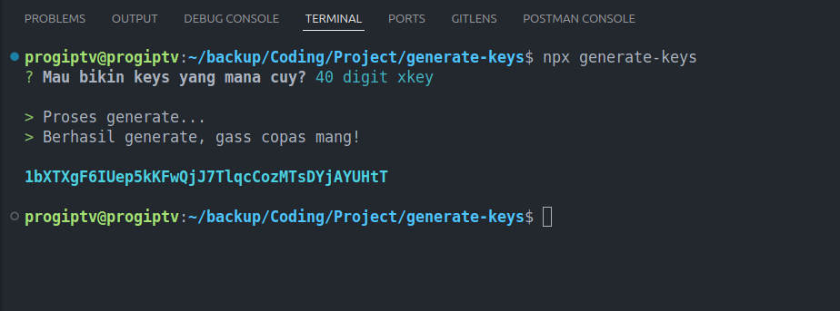

# generate-keys

This repository contains a utility for generating random 16 or 40-digit keys. This tool is useful for creating random keys for passwords, tokens, or any other application that requires random numeric strings.



# Features

- Generate 16 or 40-digit random keys
- Easy-to-use command-line interface
- Fast and efficient random key generation

## Installation

You can get it on npm.

```sh
npm i generate-keys
```

## Usage

Run command from cli:

```sh
npx generate-keys
```

You will be shown to choose between 16 digits or 40 digits, then the keys will be generated.

## Dependencies Usage

Used as dependency:

```sh
import { generateKeys } from "generate-keys"
```

(example of ES6 Module)