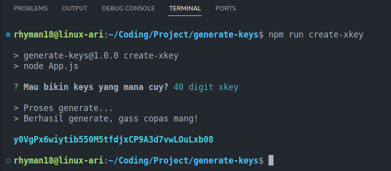

# generate-keys

Tool for generate 16 &amp; 40 digits keys.



## Install

You can get it on npm.

```sh
npm install generate-keys
```

## Requirements

Make sure [inquirer.js](https://www.npmjs.com/package/inquirer) installed on your node.

```sh
npm install -g inquirer
```

## Usage

Run command from cli:

```sh
npx create-xkey
```

You will be shown to choose between 16 digits or 40 digits, then the keys will be generated.